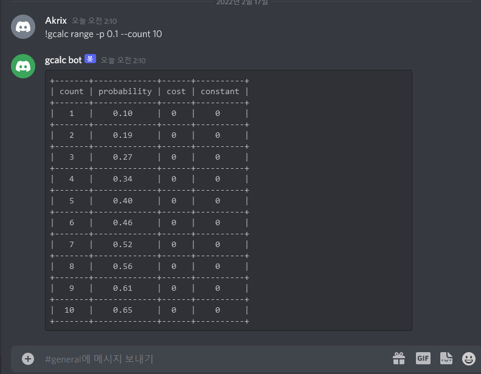

# Lgcalc : gcalc discord bot

Lgcalc is a [gcalc](https://github.com/simhyeon/gcalc) discord bot.

Running server resides in [repl](https://replit.com/@Simhyeon/lgcalc)

### Structure

Lgcalc is a discordia API extended **lua** program which executes gcalc binary.

### Usage

Simply put a excalmation mark before normal gcalc command in chat.

```bash
!gcalc range -p 0.1 --count 10
```

will be converted to table by bot as,


